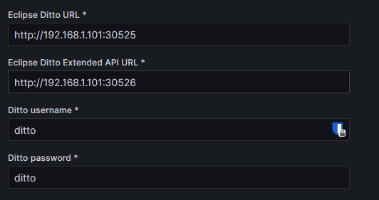

# emtrack-k8s

Este repositorio contiene los scripts, documentación, y ficheros complementarios
necesarios para poder realizar el despliegue del trabajo de fin de grado.

## Requisitos

Necesitaremos un cluster kubernetes, este repositorio asume que se utiliza
k3s, el cual puede ser instalado siguiendo su
[documentación oficial](https://docs.k3s.io/installation).
Hasta el momento, solo se ha probado a desplegar en un cluster de un solo
nodo.

## Despliegue

- IMPORTANTE: Asegurarse de que el cluster configurado en el kubeconfig es el que queremos
(ver kubectx).

- Opcional: Ejecutar `bash scripts/harbor-deploy.sh <ENV_FILE>` para desplegar harbor, un
registro de contenedores local de codigo abierto que se ejecutará en nuestro
cluster. De esta forma podremos alojar las imágenes docker de nuestros
contenedores. También es posible obviar este paso y usar un registro de nuestra
preferencia, ya sea local o en la nube.

- Ejecutar `bash scripts/tfg-deploy.sh <ENV_FILE>`.

- Iniciar sesión en Grafana y configurar en plugins -> opentwins los ajustes pertinentes.

- Ejecutar `bash scripts/import-resources.sh <ENV_FILE>`.

- Entrar en el data source mysql y refrescar la página (raro)

## Actualización

- Ejecutar `bash scripts/tfg-deploy.sh <ENV_FILE>`.
- Ejecutar `bash scripts/import-resources.sh <ENV_FILE>`.
